# IG.NEWS

<h1 align="center">
    
</h1>

[](./LEIAME.md)

## Summary

- [🧾 About](#-about)
- [🚀 Main technologies](#-main-technologies)
- [🔽 How to download the project](#-how-to-download-the-project)
- [💻 How to run the project](#-how-to-run-the-project)
- [👨‍🔧 Services](#-services)
- [👌 How to use the app](#-how-to-use-the-app)
  <br>

## 🧾 About

IG.NEWS is a _newsletter_ about the [React](https://reactjs.org/) world. In it were implemented:

- Pages that use SSR (Server Side Rendering) and SSG (Static Site Generation) concepts.
- OAuth Authentication with Github using [NextAuth](https://next-auth.js.org/).
- Integration with the [Fauna](https://fauna.com/) NoSQL database.
- Integration with the [Stripe](https://stripe.com/en-br) online payments service<br>
  This App also was configured to receive some _webhooks_ from Stripe service. To be more precise, _webhooks_ like: checkout session completed, customer subscription updated and customer subscription deleted.
- Integration with the [Prismic](https://prismic.io/) headless CMS (Content Management System).
  <br>

## 🚀 Main technologies

- [React](https://reactjs.org/)
- [Typescript](https://www.typescriptlang.org/)
- [Sass](https://sass-lang.com/)
- [NextAuth](https://next-auth.js.org/)
- [Fauna](https://fauna.com/)
- [Stripe](https://stripe.com/en-br)
- [Prismic](https://prismic.io/)

_(You can see all the dependencies in the [package.json](./package.json) file)_
<br>

## 🔽 How to download the project

```bash
$ git clone https://github.com/victorbadaro/ignite-ignews
```

<br>

## 💻 How to run the project

The commands below use the [yarn](https://yarnpkg.com/) package manager. Run them in your terminal

1. Install the project dependencies

   ```bash
   $ yarn
   ```

2. This app also depends on others services to work. They are services like: payment, authentication, database and CMS. All of them should be configured before the execution of this app. See the [Services](#-services) section.

3. This app can be executed in both environments: production and development:

   - To run this application using development environment:

     ```bash
     $ yarn dev
     ```

   - To run this application using production environment:

     - Build the app

       ```bash
       $ yarn build
       ```

     - Now it's possible to run the app:

       ```bash
       $ yarn start
       ```

If everything runs correctly, a message will be displayed in your terminal informing that the server was started:

```bash
ready - started server on 0.0.0.0:3000, url: http://localhost:3000
```

After that open your browser and access: http://localhost:3000/

✅ Nice! If you followed all the steps above correctly the project will be running locally on your machine already.
<br>

## 👨‍🔧 Services

Before of all, create a file in the project root directory named `.env.local`. Insert the followings variables inside that file:

```bash
# Stripe
STRIPE_API_KEY=
NEXT_PUBLIC_STRIPE_PUBLIC_KEY=
STRIPE_WEBHOOK_SECRET=
STRIPE_SUCCESS_URL=http://localhost:3000/posts
STRIPE_CANCEL_URL=http://localhost:3000

# FaunaDB
FAUNADB_KEY=

# Github
GITHUB_CLIENT_ID=
GITHUB_CLIENT_SECRET=

# Prismic CMS
PRISMIC_ENDPOINT=
PRISMIC_ACCESS_TOKEN=
```

1. Stripe<br>
   Create an account on [Stripe](https://stripe.com/en-br) and register a product there.
   You can create a product by clicking on _**Products**_ and then click on _**Add product**_. Select the _**Recurring**_ option.
   

   Three keys are necessary to the correct integration with the Stripe service.<br>
   In the Stripe dashboard, click on _**Developers**_ menu and then _**API Keys**_ to get both keys: _**Publishable key**_ and _**Secret key**_.<br>
   Copy the keys for the file `.env.local`:<br>
   STRIPE_API_KEY=_Secrect key_<br>
   NEXT_PUBLIC_STRIPE_PUBLIC_KEY=_Publishable key_
   

   To get the last key, download the Stripe _**CLI**_:
   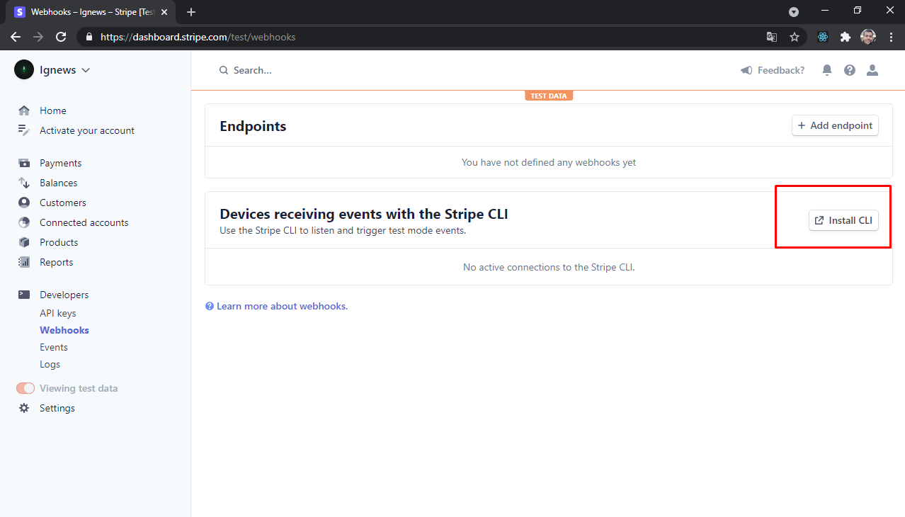

   And run the followings commands in your terminal:

   ```bash
   # Access the CLI directory
   # Run:
   ./stripe login

   # Após confirmar no navegador a autenticação execute:
   # Run the following command after confirm the authentication in the browser
   ./stripe listen --forward-to http://localhost:3000/api/webhooks
   ```

   The key will be displayed on the screen. Copy it and past it inside the file `.env.local` in front of STRIPE_WEBHOOK_SECRET=
   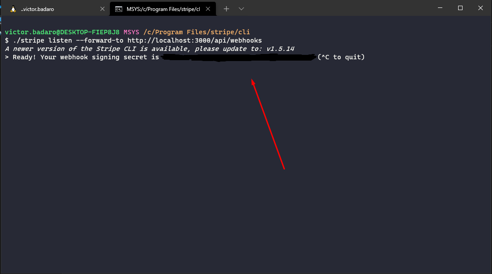

   This last command must be running during the entire execution of the project.

2. FaunaDB
   Create an account on [Fauna](https://fauna.com/) and then a _**Database**_ there.
   

   After giving a name for the created Database, create two _**Collections**_: _subscriptions_ and _users_
   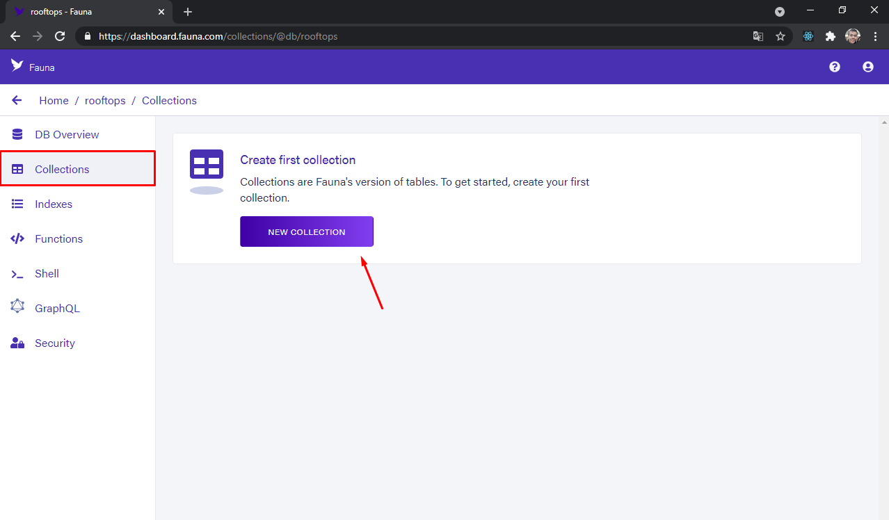
   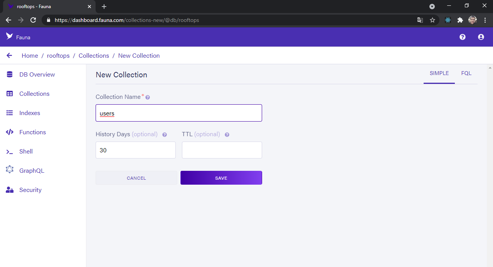

   With those Collections created, now create the Indexes below following the example of the image:
   

   ```
   Index Name: user_by_email
   Source Collection: users
   Terms: data.email
   Unique

   Index Name: user_by_stripe_customer_id
   Source Collection: users
   Terms: data.stripe_customer_id

   Index Name: subscription_by_id
   Source Collection: subscriptions
   Terms: data.id

   Index Name: subscription_by_status
   Source Collection: subscriptions
   Terms: data.status

   Index Name: subscription_by_user_ref
   Source Collection: subscriptions
   Terms: data.userId
   ```

   Now, after the database structure is ready (with Collections and Indexes), generate a _**Secret key**_. To do that, click on the _**Security**_ menu and give a name to the new key:
   

   The key will be shown on the screen:
   

   Copy that key and past it inside the `.env.local` file in front of FAUNADB_KEY=.

3. Github
   Create an account on [Github](https://github.com/). Access the account settings and then click on _**Developer settings**_.
   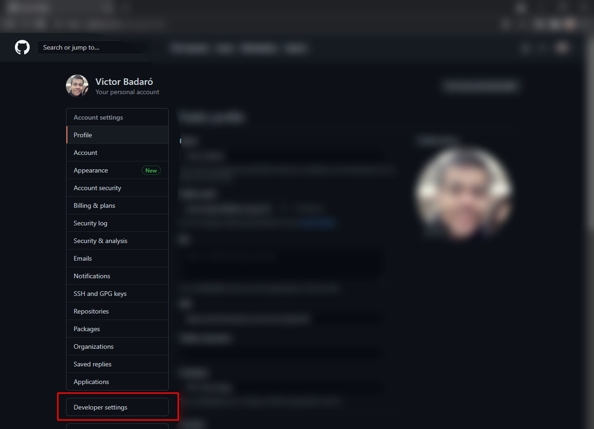

    By accessing the OAuth Apps menu, create a new OAuth App:
    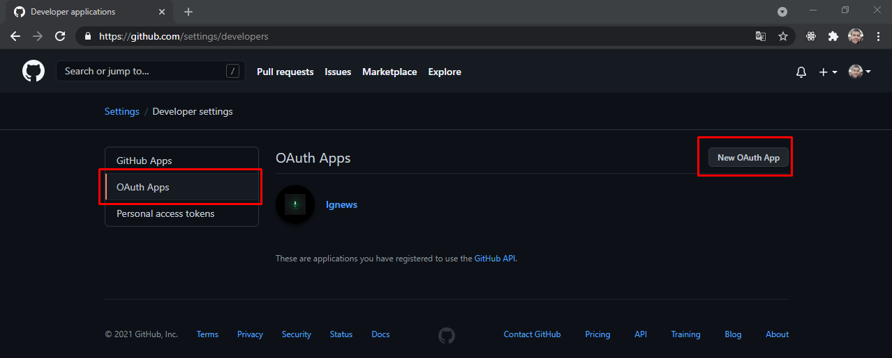

    Fill the fields that will be displayed on the screen to register the OAuth application. In _**Homepage URL**_ and _**Authorization callback URL**_ fill following the model below:<br>
    **Homepage URL** = http://localhost:3000<br>
    **Authorization callback URL** = http://localhost:3000/api/auth/callback
    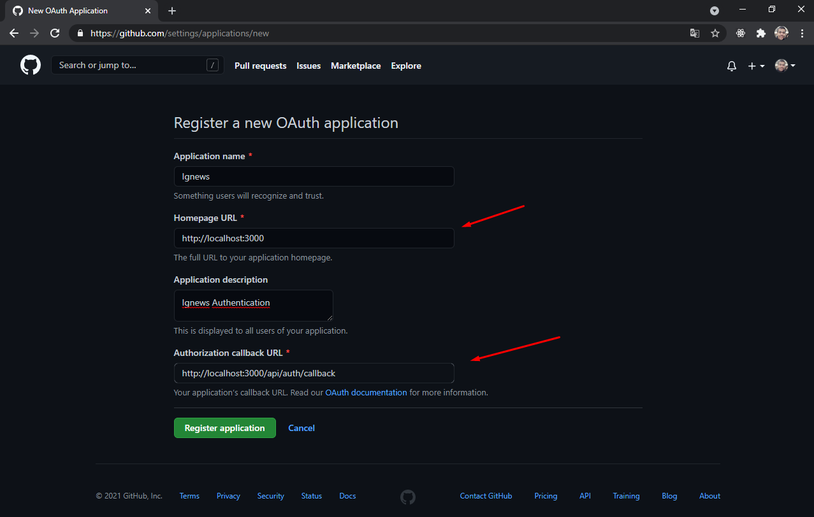

    After registering the OAuth application will be already possible to get the _**Client ID**_ and the _**Client Secret**_. The _**Client Secret**_ will be generated by clicking on the _**Generate a new client secret**_ button.<br>
    Copy the _**Client ID**_ to inside the `.env.local` file, in front of GITHUB_CLIENT_ID= and the _**Client Secret**_ in front of GITHUB_CLIENT_SECRET.<br>
    GITHUB_CLIENT_ID=_Client ID_<br>
    GITHUB_CLIENT_SECRET=_Client Secret_
    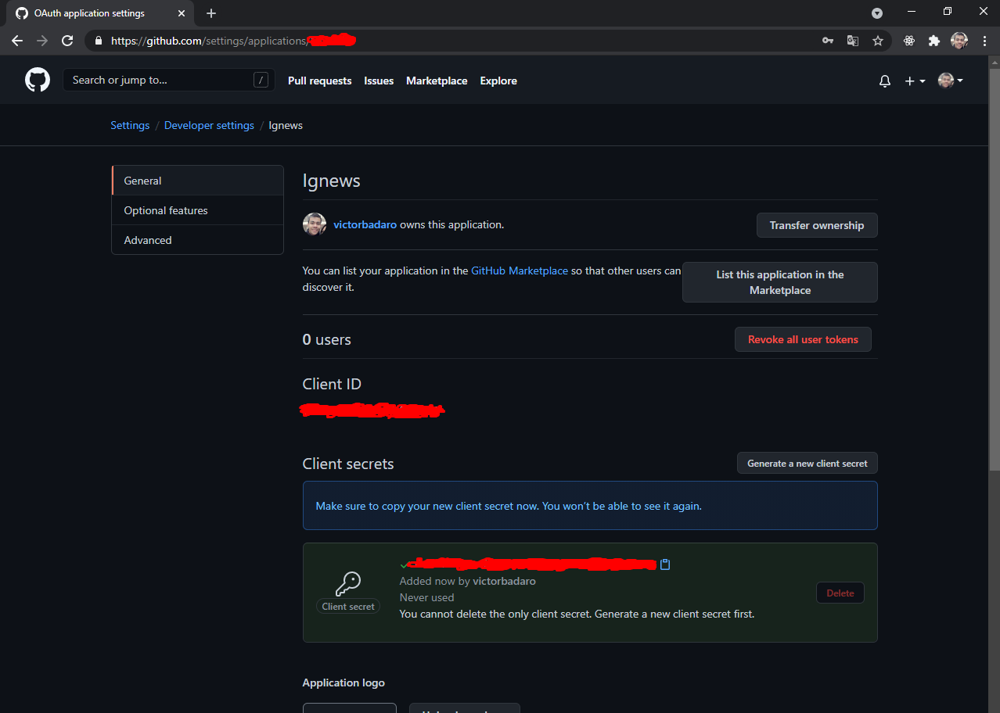

4. Prismic CMS
    Create an account on [Prismic](https://prismic.io/) and then create a repository:
    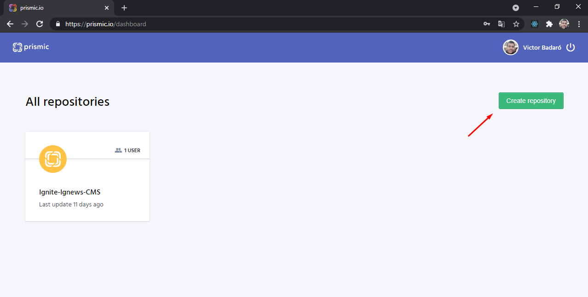

    To start creating posts on Prismic CMS you should create a _**type**_ named _**post**_ before:
    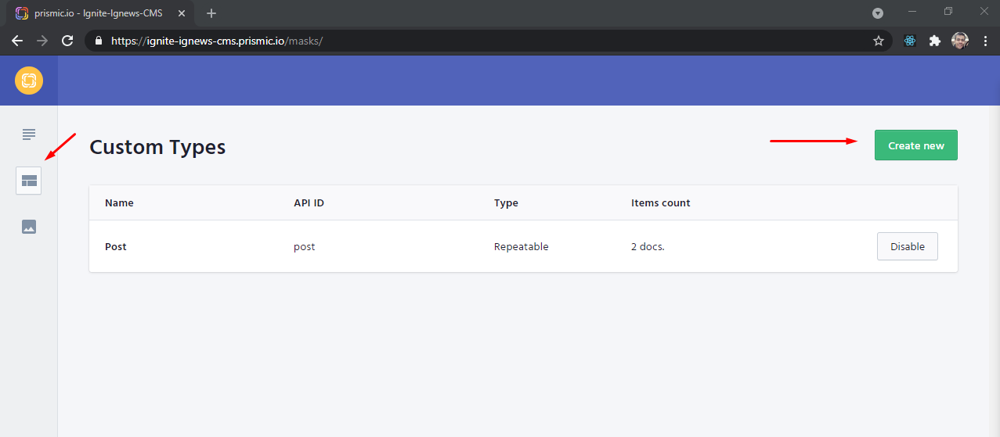

    Drag those three items highlighted on the image below (UID, Title and Rich Text) to the blank page shown on the left side.<br>
    Fill the _**API ID**_ field from each item with these contents: uid, title and content respectively.
    

    With the **post** _**type**_ created, access the _**Documents**_ menu and register the posts that will be shown on the **IG.NEWS** application:
    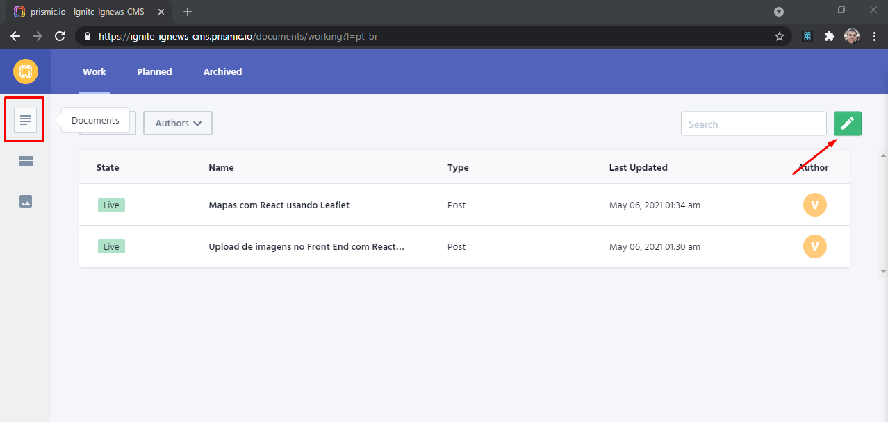

    The required fields to create a **post** are **title** and **content**:
    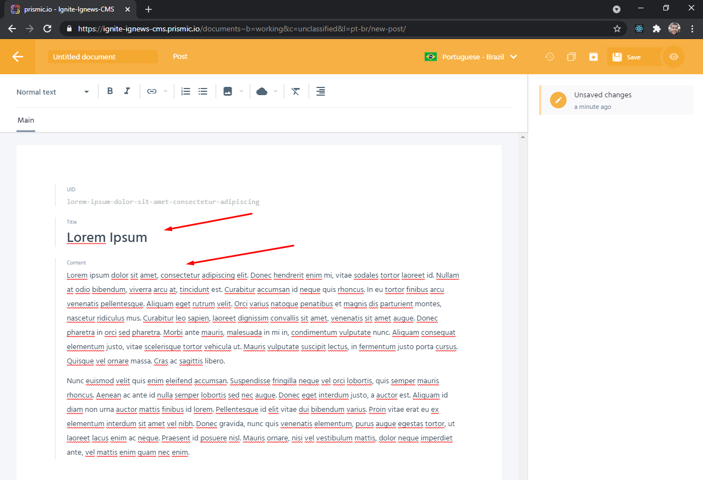

    After editing the document click on _**Save**_ and then on _**Publish**_:
    

    Now with the document ready, get the API _**Endpoint**_ and the **Prismic** access _token_.<br>
    Copy the _**API Endpoint**_ and put it in front of PRISMIC_ENDPOINT= inside the `.env.local` file:
    

    Copy the generated _**Permanent access token**_ (after clicking on _**Add token**_) and put it in front of PRISMIC_ACCESS_TOKEN= inside the `.env.local` file:
    
<br>

## 👌 How to use the app

**IG.NEWS** usage is really simple. It's a _Newsletter_ about the **React** world. The posts published in it can be viewed for everyone, but only subscribed users will have access to read completed texts. To be a subscribed user, you must have an account on **Github** (to authenticate on **IG.NEWS** website) and make a monthly payment through the **Stripe** online payment service (a value reported on the _Homepage_). Don't worry, to test the application you won't need inform real data from your credit card or something like that. On the checkout screen from **Stripe** you can use the following credit card number:<br>

> 4242 4242 4242 4242

This is a credit card number for tests from **Stripe** service.<br>
See the application flow below:


<br>

---

<p align="center">This project was created and developed with ❤ by <a href="https://github.com/victorbadaro">Victor Badaró</a></p>